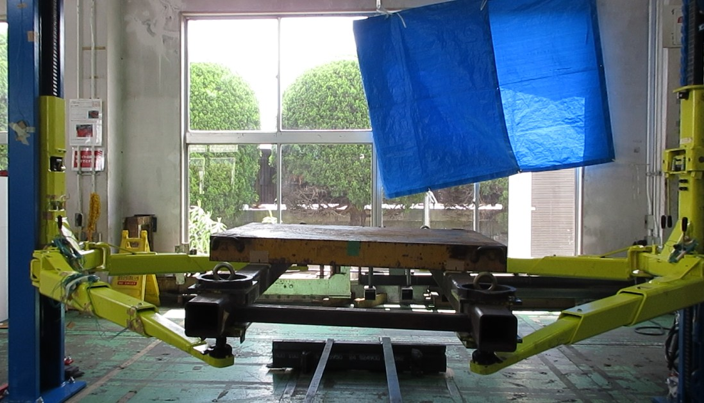
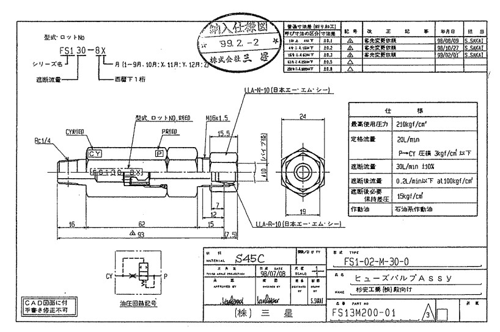

# NSA40　断流弁作動条件確認 技術判断書

**文書番号：** TD-2026-001  
**作成日：** 2026年5月21日  
**作成者：** 武村  
**件名：** 二柱式自動車整備リフト（4トン機）断流弁作動条件の妥当性判断  

2026-5-21  

NSA40にてホース破断時の断流弁の動きを、軽荷重条件も含めて実機で確認したところ、  
破断状態にもかかわらず断流弁が作動しないケースが確認された。

一見すると気になる結果ではあるが、整理すると設計不具合ではなく、断流弁の作動原理に基づくものである。

### 図1〜図3：断流弁作動試験関連

<table>
<tr>
<td align="center" valign="top">

図1：断流弁の試験条件（荷重1t負荷条件）

</td>

<td align="center" valign="top">

図2：断流弁の試験条件（断流弁直下からタンクに戻す）

</td>
</tr>
</table>

 

図3：NSAで採用している断流弁の仕様書

## 動画資料

▶ NSA40断流弁作動試験の検証動画 
1t負荷で断流弁作動せず （試験日時　2026/5/12 油温25.9℃）
https://youtu.be/Uo_GBLKJO7Y

4t負荷（定格荷重）で断流弁作動（試験日時　2026/5/12 油温25.9℃）
https://youtu.be/lKsxI_goQIQ

---

## 1. 判断結論

> **ホース破断時であっても、流量条件が閾値に達しない場合は断流弁は作動しない。これは仕様上の成立条件であり問題なし。**

---

## 2. 試験結果概要

| 条件 | 結果 |
|---|---|
| 4t定格荷重・ホース破断 | 断流弁作動 |
| 1t軽荷重・ホース破断 | 断流弁非作動 |

軽荷重条件において非作動となるケースが確認された。

---

## 3. 断流弁の機能定義

断流弁は以下を目的とする安全装置である。

- ホース破断時などの異常流量検知
- 油圧回路の遮断による急速落下抑制
- 作動条件は「破断検知」ではなく「流量条件」に依存

すなわち、断流弁は破断そのものを検知する装置ではなく、流量ベースで動作する安全弁である。

---

## 4. 非作動となる理由

ホース破断時の流量は単純に最大流量になるわけではなく、以下の要因に依存する。

- 油圧回路の圧力状態
- フロコントロールバルブのバイパス挙動
- 回路全体の流路抵抗

そのため、

> 破断状態であっても、必ずしも作動流量に到達するとは限らない

という構造になる。

---

## 5. 1t条件での挙動

軽荷重（1t）条件では以下が確認された。

- フロコンはバイパス状態となる場合がある
- ただし流量は断流弁作動域（27〜33 L/min）に到達しない
- 結果として断流弁は非作動

---

## 6. 流量条件の整理

| 条件 | 流量 |
|---|---|
| 通常下降（4t） | 約11.8 L/min |
| 断流弁作動閾値 | 27〜33 L/min |

通常領域と作動領域は明確に分離されている。

---

## 7. 安全性の整理

断流弁の目的は異常流量時の急速落下抑制である。

今回の結果は以下の通り整理される。

- 通常下降：非作動（設計通り）
- 高流量異常時：作動（設計通り）
- 軽荷重破断：非作動（流量未達によるもの）

ただし軽荷重条件においても下降挙動は制御範囲内にあり、安全上の問題はない。

---

## 8. 4t化との関係

本件に関して、以下の構成要素は変更されていない。

- 油圧回路
- 断流弁仕様
- シリンダ系統

一部配管変更はあるが、流量成立条件への影響は限定的である。

したがって、本事象は4t化に起因するものではない。

---

## 9. 技術的整理

今回の結果は以下に集約される。

- 断流弁は破断検知ではなく流量検知型である
- 破断状態でも流量条件が成立しなければ作動しない
- NSA37の設計思想とも整合している

---

## 10. 最終判断

以上より、以下の通り判断する。

| 項目 | 結論 |
|---|---|
| 断流弁機能 | 正常 |
| 軽荷重非作動 | 仕様通り |
| 設計妥当性 | 問題なし |
| 4t化影響 | なし |

---

## 11. 結論

本件は以下として整理される。

> ホース破断時であっても流量条件に依存して断流弁は非作動となり得るが、これは仕様上の成立条件であり設計不具合ではない。

以上より、本件は「不具合」ではなく「断流弁の成立条件を実機で確認した結果」である。